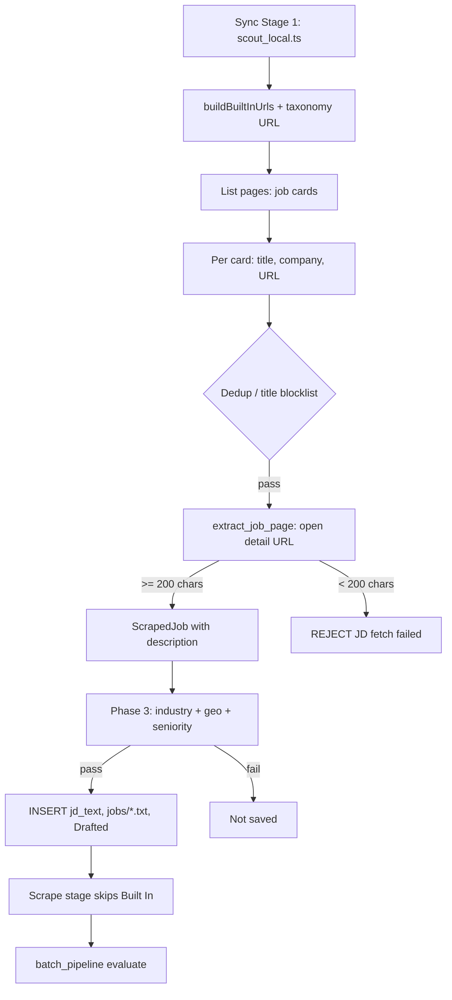

# Built In Pipeline — Complete Code Report

**Generated for:** JobAgent / Applyr  
**Spec IDs:** FR-078, FR-079, FR-180 (CR-009, CR-033)  
**Primary files:** `scripts/scout_local.ts`, `scripts/extract_job_page.ts`, `scripts/scrape_new_jobs.ts`  
**Orchestration:** `server/scout.ts` → `scout_local.ts` (stage 1) → `scrape_new_jobs.ts` (stage 3, only `status = 'New'`)

---

## Table of contents

1. [End-to-end flow](#1-end-to-end-flow)
2. [URL construction](#2-url-construction-prefs-driven)
3. [Listing crawl — scoutBuiltIn](#3-listing-crawl--scoutbuiltin)
4. [Detail-page JD extraction](#4-detail-page-jd-extraction--extract_job_pagets)
5. [Post-scout gates](#5-post-scout-gates)
6. [Persist after gates](#6-persist-after-gates)
7. [Pipeline orchestration](#7-pipeline-orchestration-serverscoutts)
8. [Browser invocation](#8-browser-invocation)
9. [Fallback scrape stage](#9-fallback-scrape-stage)
10. [Diagnostics](#10-diagnostics)
11. [Log lines reference](#11-log-lines-reference)
12. [Requirements map](#12-requirements-map)
13. [File index](#13-file-index)
14. [Full source listings](#14-full-source-listings)

---

## 1. End-to-end flow

```
Sync Stage 1 (scout_local.ts)
  → buildBuiltInUrlsForTerm() + buildBuiltInTaxonomyUrl()
  → Listing pages: .job-item / div[data-id="job-card"]
  → Per card: title, company, URL
  → Dedup + title blocklist
  → extract_job_page.ts: open detail URL in new tab
  → If description < 200 chars: REJECT (JD fetch failed)
  → If OK: ScrapedJob with full description
  → Phase 3 merge: industry + geographic + seniority gates
  → INSERT jd_text, write jobs/Company_id8.txt, status = Drafted
  → Stage 3 scrape_new_jobs: SKIPS Built In (already Drafted, not New)
  → Stage 4 batch_pipeline.py: evaluate from staging file / jd_text
```

**Mermaid (optional renderers):**



---

## 2. URL construction (prefs-driven)

**Source:** `scripts/scout_local.ts` (lines ~145–201)

Built In URLs depend on `data/candidate_preferences.json`:

- `WORK_SETTING` → path prefix: `remote` | `hybrid` | (none for on-site)
- `SEARCH_TERMS` → one search URL per term
- `FRESHNESS_DAYS` → `daysSinceUpdated` / `days_since_posted`
- `EXPERIENCE_LEVELS` → Built In experience slugs via `BUILTIN_EXP_SLUGS`

**Experience slug map:**

```typescript
const BUILTIN_EXP_SLUGS: Record<string, string> = {
    'Internship':             'internship',
    'Entry Level (0-1 Years)': 'entry-level',
    'Junior (1-2 Years)':     'entry-level',
    'Mid Level (2-5 Years)':  'mid-level',
    'Senior Level (5-9 Years)': 'senior-level',
    'Expert/Leader (9+ Years)': 'senior-level',
};
```

**Per-term search URL builder:**

```typescript
function buildBuiltInUrlsForTerm(term: string): string[] {
    const workPrefix = WORK_SETTING === 'Hybrid' ? 'hybrid' : WORK_SETTING === 'On-site' ? '' : 'remote';
    const expSlugs = EXPERIENCE_LEVELS.length > 0
        ? [...new Set(EXPERIENCE_LEVELS.map(l => BUILTIN_EXP_SLUGS[l]).filter(Boolean))]
        : [];

    const targets: string[] = [];
    const pathSegments = ['jobs'];

    if (workPrefix) pathSegments.push(workPrefix);
    if (expSlugs.length > 0) pathSegments.push(expSlugs[0]);

    const basePath = pathSegments.join('/');

    let query = `?search=${encodeURIComponent(term)}&daysSinceUpdated=${FRESHNESS_DAYS}&days_since_posted=${FRESHNESS_DAYS}&country=USA&allLocations=true`;

    if (expSlugs.length > 1) {
        for (let i = 1; i < expSlugs.length; i++) {
            query += `&experience%5B%5D=${expSlugs[i]}`;
        }
    }

    targets.push(`https://builtin.com/${basePath}${query}`);
    return targets;
}
```

**Taxonomy fallback URL:**

```typescript
function buildBuiltInTaxonomyUrl(): string {
    const workPrefix = WORK_SETTING === 'Hybrid' ? 'hybrid' : WORK_SETTING === 'On-site' ? '' : 'remote';
    const base = workPrefix
        ? `https://builtin.com/jobs/${workPrefix}/product-management`
        : 'https://builtin.com/jobs/product-management';

    let url = `${base}?days_since_posted=${FRESHNESS_DAYS}`;

    if (EXPERIENCE_LEVELS.length > 0) {
        const slugs = [...new Set(EXPERIENCE_LEVELS.map(l => BUILTIN_EXP_SLUGS[l]).filter(Boolean))];
        for (const slug of slugs) url += `&experience%5B%5D=${slug}`;
    }

    return url;
}
```

**Example search URL shape:**

`https://builtin.com/jobs/remote/mid-level?search=Product+Manager&daysSinceUpdated=7&days_since_posted=7&country=USA&allLocations=true`

---

## 3. Listing crawl — scoutBuiltIn

**Source:** `scripts/scout_local.ts` — `scoutBuiltIn(page: Page)`

**When it runs:** Scout Phase 2, after parallel API sources. Uses non-headless persistent context at `data/browser_context`.

**Target list:**

1. For each `SEARCH_TERMS` entry → `buildBuiltInUrlsForTerm(term)`
2. Plus `buildBuiltInTaxonomyUrl()` labeled `Taxonomy Fallback`

**Card selectors (FR-078 dual layout):**

| Field   | CSS selectors |
|---------|----------------|
| Title   | `[data-id="job-card-title"]`, `.card-alias-after-overlay` |
| Company | `[data-id="company-title"]`, `a[href^="/company/"]` |
| Link    | `href` on title anchor |
| Cards   | `.job-item`, `div[data-id="job-card"]` |

**Pre-JD filters (per card):**

- `seenUrls` (in-run dedup)
- `passesTitleBlocklist(title)`
- `isJobNewByUrl(url)` — SQLite
- `isJobNewByCompanyTitle(company, title)` — SQLite

**JD fetch (FR-180):**

- `extractJobDescriptionFromPage(page.context(), url, MIN_JD_CHARS)` — new tab per job
- Reject if empty / &lt; 200 chars
- `humanWait(1500, 3000)` after each successful fetch
- Cap: **60 jobs** aggregate per scout run

**Full scoutBuiltIn function:**

```typescript
const scoutBuiltIn = async (page: Page): Promise<ScrapedJob[]> => {
    console.log('[LOG] Built In: Scouting multiple target channels...');
    const jobs: ScrapedJob[] = [];
    const seenUrls = new Set<string>();

    const targets: { url: string; label: string }[] = [];
    for (const term of SEARCH_TERMS) {
        const urls = buildBuiltInUrlsForTerm(term);
        for (const u of urls) {
            targets.push({ url: u, label: `Search: ${term}` });
        }
    }
    targets.push({ url: buildBuiltInTaxonomyUrl(), label: 'Taxonomy Fallback' });

    for (const target of targets) {
        try {
            console.log(`[LOG] Built In: Crawling ${target.label}...`);
            await page.goto(target.url, { waitUntil: 'domcontentloaded' });
            await page.waitForLoadState('networkidle', { timeout: 8000 }).catch(() => {});
            await humanWait(2000, 4000);

            await page.waitForSelector('.job-item, div[data-id="job-card"]', { timeout: 10000 }).catch(() => {});

            const cards = await page.$$('.job-item, div[data-id="job-card"]');
            console.log(`[LOG] Built In: ${cards.length} cards found for ${target.label}.`);

            for (const card of cards) {
                if (jobs.length >= 60) break;
                try {
                    const title = (await card.$eval('[data-id="job-card-title"], .card-alias-after-overlay', el => el.textContent).catch(() => '')).trim();

                    const company = (await card.$eval('[data-id="company-title"]', el => el.textContent).catch(() =>
                                     card.$eval('a[href^="/company/"]', el => el.textContent).catch(() => ''))).trim();

                    const relUrl = await card.$eval('[data-id="job-card-title"], a.card-alias-after-overlay', el => el.getAttribute('href')).catch(() => '');

                    if (!relUrl || !title || !company) continue;

                    const url = relUrl.startsWith('http') ? relUrl : `https://builtin.com${relUrl}`;

                    if (seenUrls.has(url)) continue;
                    seenUrls.add(url);

                    if (!passesTitleBlocklist(title)) {
                        console.log(`[REJECT] ${title} at ${company} (Built In) - Title Blocklist`);
                        continue;
                    }
                    if (!isJobNewByUrl(url)) {
                        console.log(`[REJECT] ${title} at ${company} (Built In) - URL already exists`);
                        continue;
                    }
                    if (!isJobNewByCompanyTitle(company, title)) {
                        console.log(`[REJECT] ${title} at ${company} (Built In) - Company/Title already exists`);
                        continue;
                    }

                    console.log(`[LOG] Built In: Fetching JD for ${title}...`);
                    const description = await extractJobDescriptionFromPage(page.context(), url, MIN_JD_CHARS);
                    if (!description) {
                        console.log(`[REJECT] ${title} at ${company} (Built In) - JD fetch failed or too short`);
                        continue;
                    }
                    console.log(`[LOG] Built In: JD fetched (${description.length} chars)`);
                    jobs.push({ company, title, url, description, source: 'Built In' });
                    console.log(`[FOUND] ${title} at ${company} (Built In)`);
                    await humanWait(1500, 3000);
                } catch (cardErr) {
                    console.log(`[LOG] Built In card process failed: ${cardErr}`);
                }
            }
        } catch (err) {
            console.log(`[LOG] Built In scrape failed for ${target.label}: ${err}`);
        }

        await humanWait(1500, 3000);
    }

    return jobs;
};
```

**Import at top of scout_local.ts:**

```typescript
import { extractJobDescriptionFromPage, MIN_JD_CHARS } from './extract_job_page.js';
```

---

## 4. Detail-page JD extraction — extract_job_page.ts

**File:** `scripts/extract_job_page.ts`  
**Implements:** FR-180 (CR-033)

**Constants:**

- `MIN_JD_CHARS = 200` — minimum to accept
- `MAX_JD_CHARS = 15000` — stored cap

**DOM strategy (in-browser evaluate):**

1. Try selectors with content &gt; 300 chars:
   - `[data-id="job-description"]`
   - `[data-id="job-content"]`
   - `.job-description`, `#job-description`
   - `.description`, `#description`
   - `.JobDescription_jobDescription`
   - `article`, `main`
2. Find heading matching `/job description/i`, walk next siblings
3. Retry selectors with &gt; 200 chars
4. Fallback: `document.body.innerText`

**Playwright wrapper:**

- New page per URL
- `goto` domcontentloaded, 45s timeout
- `networkidle` 8s (ignored on failure)
- Fixed 2.5s wait
- Close page in `finally`

**Full file:**

```typescript
/**
 * Implements FR-180 (CR-033): shared Playwright JD extraction for job detail pages.
 */
import { BrowserContext } from 'playwright';

export const MIN_JD_CHARS = 200;
export const MAX_JD_CHARS = 15000;

function extractInBrowser(): string {
    const selectors = [
        '[data-id="job-description"]',
        '[data-id="job-content"]',
        '.job-description',
        '#job-description',
        '.description',
        '#description',
        '.JobDescription_jobDescription',
        'article',
        'main',
    ];
    for (const sel of selectors) {
        const el = document.querySelector(sel) as HTMLElement | null;
        if (el && el.innerText.trim().length > 300) {
            return el.innerText.trim();
        }
    }
    const headings = Array.from(document.querySelectorAll('h1, h2, h3, h4'));
    for (const h of headings) {
        if (/job description/i.test(h.textContent || '')) {
            let sib: Element | null = h.nextElementSibling;
            while (sib) {
                const t = (sib as HTMLElement).innerText?.trim() || '';
                if (t.length > 300) return t;
                sib = sib.nextElementSibling;
            }
        }
    }
    for (const sel of selectors) {
        const el = document.querySelector(sel) as HTMLElement | null;
        if (el && el.innerText.trim().length > 200) {
            return el.innerText.trim();
        }
    }
    return document.body ? document.body.innerText.trim() : '';
}

export async function extractJobDescriptionFromPage(
    context: BrowserContext,
    url: string,
    minChars: number = MIN_JD_CHARS,
): Promise<string> {
    const page = await context.newPage();
    try {
        await page.goto(url, { waitUntil: 'domcontentloaded', timeout: 45000 });
        await page.waitForLoadState('networkidle', { timeout: 8000 }).catch(() => {});
        await new Promise((r) => setTimeout(r, 2500));

        const text = await page.evaluate(extractInBrowser);
        const trimmed = (text || '').trim();
        if (trimmed.length < minChars) return '';
        return trimmed.slice(0, MAX_JD_CHARS);
    } catch {
        return '';
    } finally {
        await page.close().catch(() => {});
    }
}
```

---

## 5. Post-scout gates

Applied in Phase 3 to **all** sources after merge/dedup (`uniqueJobs.filter`).

### 5.1 Geographic gate — passesGeographicGate (FR-070, FR-173)

**Input text:** `title + description` (lowercased)

**Empty description (&lt; 50 chars) + Remote work_setting:**

- Auto-pass only: `Remotive`, `RemoteOK`, `WWR`, `Himalayas`
- **Built In is NOT in this list** → `remote_only_no_location_signal`
- With FR-180, Built In usually has full JD, so this branch rarely applies

**Non-empty description:**

- Accept if: San Diego area keywords OR `remote` / `work from home` / etc.
- Reject explicit foreign (Canada, UK, EU, India, APAC) without US indicators
- API remote boards still auto-pass at end if in `explicitRemoteSources`
- **Otherwise return false** (on-site / unknown location for board-sourced jobs)

```typescript
function passesGeographicGate(job: ScrapedJob): boolean {
    const text = `${job.title} ${job.description || ''}`.toLowerCase();

    if ((job.description || '').trim().length < 50) {
        if (WORK_SETTING === 'Remote') {
            const remoteOnlySources = ['Remotive', 'RemoteOK', 'WWR', 'Himalayas'];
            if (remoteOnlySources.includes(job.source)) return true;
            console.log(`[REJECT] ${job.title} at ${job.company} (${job.source}) - [GEOGRAPHIC REJECT] remote_only_no_location_signal`);
            return false;
        }
        return true;
    }

    const hasLocalSD = text.includes('san diego') ||
                       text.includes('carlsbad') ||
                       text.includes('la jolla') ||
                       text.includes('encinitas') ||
                       text.includes('del mar') ||
                       text.includes('solana beach') ||
                       text.includes('ca');

    const hasRemote = text.includes('remote') ||
                      text.includes('anywhere in') ||
                      text.includes('work from home') ||
                      text.includes('telecommute');

    const isExplicitForeign = (
        text.includes('canada') ||
        text.includes('united kingdom') ||
        text.includes('london,') ||
        text.includes('europe') ||
        text.includes('germany') ||
        text.includes('india') ||
        text.includes('apac')
    ) && !(
        text.includes('united states') ||
        text.includes('within the us') ||
        text.includes('us citizen')
    );

    if (isExplicitForeign) return false;
    if (hasLocalSD || hasRemote) return true;

    const explicitRemoteSources = ['Remotive', 'RemoteOK', 'WWR', 'Himalayas'];
    if (explicitRemoteSources.includes(job.source)) return true;

    return false;
}
```

### 5.2 Industry gate — passesIndustryGate (FR-170)

- Always: `company`, `title` vs `blocked_industries`
- Description: only if `0 < length <= 120` (short snippet)
- Full Built In JD (&gt; 120) does **not** scan description for industry at scout

### 5.3 Seniority gate — passesSeniorityGate (FR-135)

- Title vs `TITLE_BLOCKLIST` (whole-word)
- If `description.length >= 80`: parse max years from `title + description`; reject if &gt; `prefs.experience_range.max` (default 7)

---

## 6. Persist after gates

**Phase 3 save loop** (all sources; Built In with JD uses `Drafted`):

```typescript
const insert = DB.prepare(`
    INSERT INTO jobs (id, company, title, url, status, salary_range, recruiter_name, recruiter_url, source_site, jd_text, created_at)
    VALUES (?, ?, ?, ?, ?, ?, ?, ?, ?, ?, CURRENT_TIMESTAMP)
`);
const jobsDir = path.resolve('jobs');
if (!fs.existsSync(jobsDir)) fs.mkdirSync(jobsDir, { recursive: true });

for (const job of gatedJobs) {
    const id = randomUUID();
    const desc = (job.description || '').trim();
    const hasJd = desc.length >= MIN_JD_CHARS;
    const status = hasJd ? 'Drafted' : 'New';
    insert.run(id, job.company, job.title, job.url || null, status,
        job.salary_range || null, job.recruiter_name || null,
        job.recruiter_url || null, job.source, hasJd ? desc : null);
    if (hasJd && job.url) {
        const companyFilename = job.company.replace(/[^a-z0-9]+/gi, '_').trim();
        const jdPath = path.join(jobsDir, `${companyFilename}_${id.slice(0, 8)}.txt`);
        fs.writeFileSync(jdPath, `URL: ${job.url}\n\n${desc}`, 'utf-8');
    }
}
```

| Column / artifact | Built In typical value |
|-------------------|-------------------------|
| `source_site`     | `'Built In'`            |
| `jd_text`         | Full text (≤ 15k chars) |
| `status`          | `'Drafted'`             |
| Staging file      | `jobs/{Company}_{id8}.txt` |

---

## 7. Pipeline orchestration (server/scout.ts)

| Stage | Script | Built In |
|-------|--------|----------|
| 1 SCOUT | `scripts/scout_local.ts` | Detail JD + gates + save |
| 2 BACKFILL | `scripts/archive/backfill_urls.ts` | — |
| 3 SCRAPE | `scripts/scrape_new_jobs.ts` | Skipped (not `New`) |
| 4 EVALUATE | `scripts/batch_pipeline.py` | Reads staging / jd_text |

```typescript
// Stage 1
const scoutSpawn = buildTsxSpawn('scripts/scout_local.ts');

// Stage 3 (after requeue_needs_retry)
const scrapeSpawn = buildTsxSpawn('scripts/scrape_new_jobs.ts');
```

Log routing: `[FOUND]` → UI "Match Found"; `[REJECT]` → "Skipped".

---

## 8. Browser invocation

```typescript
const context = await chromium.launchPersistentContext(CONTEXT_DIR, {
    headless: false,
    viewport: { width: 1440, height: 900 },
    args: ['--disable-blink-features=AutomationControlled'],
});
const page = context.pages()[0] || await context.newPage();

const biResult = await runWithHealth('BuiltIn', () => scoutBuiltIn(page));
browserJobs = [...biResult.jobs, ...lvResult.jobs];
await context.close();
```

- `CONTEXT_DIR` = `data/browser_context`
- LinkedIn: permanently skipped (CR-010)
- Levels.fyi runs after Built In on same page/context

---

## 9. Fallback scrape stage

**File:** `scripts/scrape_new_jobs.ts`

- Query: `SELECT ... FROM jobs WHERE status = 'New'`
- Uses same `extractJobDescriptionFromPage`
- On success: write `jobs/*.txt`, `UPDATE status = 'Drafted', jd_text = ?`
- Built In jobs saved by scout are **already Drafted** → not selected here

---

## 10. Diagnostics

**File:** `scripts/diagnose_last_run.py`

- Counts Built In by `status`
- Recent rows with `length(jd_text)`
- `COUNT` where `source_site = 'Built In' AND length(jd_text) > 200`

---

## 11. Log lines reference

| Log prefix | Meaning |
|------------|---------|
| `[LOG] Built In: Crawling Search: …` | Opening listing URL |
| `[LOG] Built In: N cards found` | Cards on page |
| `[LOG] Built In: Fetching JD for …` | Opening detail page |
| `[LOG] Built In: JD fetched (N chars)` | Extraction OK |
| `[FOUND] … (Built In)` | Queued for Phase 3 gates |
| `[REJECT] … JD fetch failed or too short` | Detail page failed |
| `[REJECT] … [GEOGRAPHIC REJECT]` | Failed geo on full text |
| `[REJECT] … Title Blocklist` | Title gate on card |
| `[REJECT] … URL already exists` | DB dedup |

---

## 12. Requirements map

| ID | Summary | Where |
|----|---------|-------|
| FR-078 | Dual card layouts | `scoutBuiltIn` selectors |
| FR-079 | Multi-term search URLs | `buildBuiltInUrlsForTerm` loop |
| FR-180 | Detail JD before gates | `extract_job_page.ts`, scoutBuiltIn |
| FR-070 | Geographic gate | `passesGeographicGate` |
| FR-173 | No empty-stub bypass for Built In | geo gate source list |
| FR-170 | Industry blocklist | `passesIndustryGate` |
| FR-135 | Seniority / years | `passesSeniorityGate` |
| FR-080 | LinkedIn off | bypass log only |

**Docs:**

- `docs/spec/05-change-requests/CR-009-builtin-search-crawler.md`
- `docs/spec/05-change-requests/CR-033-builtin-detail-jd-ingest.md`
- `docs/spec/08-implementation/IMP-CR-033-builtin-detail-jd.md`
- `docs/spec/03-feature-specs/FEAT-001-scouting.md`

---

## 13. File index

| Path | Role |
|------|------|
| `scripts/scout_local.ts` | URLs, scoutBuiltIn, gates, SQLite + staging |
| `scripts/extract_job_page.ts` | Playwright JD extraction |
| `scripts/scrape_new_jobs.ts` | Scrape for `New` non–Built In rows |
| `server/scout.ts` | Sync pipeline spawn |
| `data/candidate_preferences.json` | Prefs (gitignored; use `.example`) |
| `data/browser_context/` | Persistent Playwright profile |
| `jobs/*.txt` | Evaluate staging queue |
| `jobagent.sqlite` | `jobs` table |

---

## 14. Full source listings

For line-accurate code, open these files in the repo:

1. `scripts/scout_local.ts` — lines 1–10 (imports), 145–201 (URLs), 256–316 (geo), 498–584 (scoutBuiltIn), 1120–1200 (browser + save)
2. `scripts/extract_job_page.ts` — entire file (72 lines)
3. `scripts/scrape_new_jobs.ts` — entire file (~67 lines)
4. `server/scout.ts` — lines 108–172 (stages)

**Release note:** PRODUCT_CAPABILITIES_AND_RELEASE_NOTES.md — **6.2.25** (FR-180 / CR-033).

---

*End of report.*
