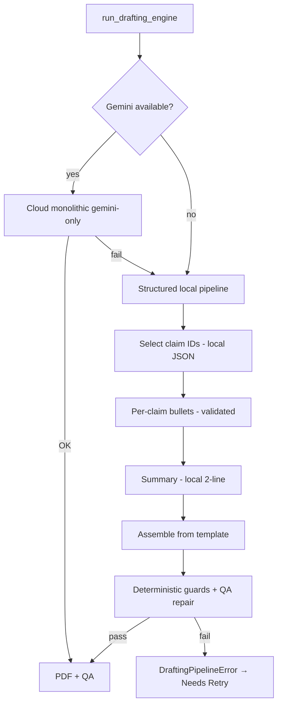

# CR-012: Gemini-Primary with Structured Local Fallback Pipeline

## Metadata

| Field | Value |
|---|---|
| **CR ID** | `CR-012` |
| **Status** | Approved |
| **Priority** | P0 |
| **Date** | 2026-05-20 |
| **Implements** | `FR-081`, `FR-082`, `FR-083`, `FR-084` |

## Problem

When Gemini is primary but hits quota (429), `call_llm` falls back to local inside **monolithic** resume/cover prompts. Local models miss required sections (`PROFESSIONAL SUMMARY`, etc.), hallucinate metrics, and fail `quality_checker` with a hard `ValueError` that breaks the batch.

`CR-007` two-phase local generation only runs when `is_local_primary()` — **not** on Gemini→local fallback.

## Functional requirements

| ID | Requirement |
|---|---|
| `FR-081` | Gemini remains primary for fit + drafting when quota allows |
| `FR-082` | On cloud draft failure or quota, use **structured local pipeline** (bite-sized steps), not monolithic local |
| `FR-083` | Local output must pass `quality_checker` + deterministic fact guards; no uncaught exceptions abort batch |
| `FR-084` | Draft failure surfaces as `Needs Retry`, not process crash |

## Ten approaches evaluated

| # | Approach | Verdict |
|---|----------|---------|
| 1 | Keep monolithic local fallback, lower QA bar | Reject — does not meet quality bar |
| 2 | Block all local fallback (Gemini-only) | Reject — user needs offline path |
| 3 | **Structured assembler + per-claim bullets** (CR-007 extended to fallback) | **Implement** |
| 4 | Template-only resume (zero LLM for body) | Partial — use for EDUCATION + headers |
| 5 | Cloud retry queue, skip local | Reject — no resilience |
| 6 | Smaller cloud model (Flash-Lite) on 429 | Future — provider config |
| 7 | **Deterministic QA repair** before fail | **Implement** |
| 8 | **Gemini-only monolithic; explicit local route** | **Implement** |
| 9 | Human-in-loop approve markdown | Future |
| 10 | **Non-fatal `DraftingPipelineError`** | **Implement** |

## Architecture (bite-sized local steps)

## Implementation tasks

1. `scripts/local_draft_pipeline.py` — structured assembler
2. `scripts/drafting_errors.py` — `DraftingPipelineError`
3. `scripts/quality_checker.py` — `repair_resume_markdown`
4. `scripts/drafting_engine.py` — orchestration + gemini-only overrides
5. `scripts/batch_pipeline.py` — remove draft-only Gemini block; catch pipeline errors
6. Registry + traceability updates

## Acceptance criteria

- `AC-083`: With Gemini 429, batch completes; job marked `Needs Retry` or gets PDFs via structured local when VRAM allows
- `AC-084`: Structured local resume includes all three `##` sections and Cision/Sterkly/ZTS mentions
- `AC-085`: No `ValueError` from QA aborts entire batch run
