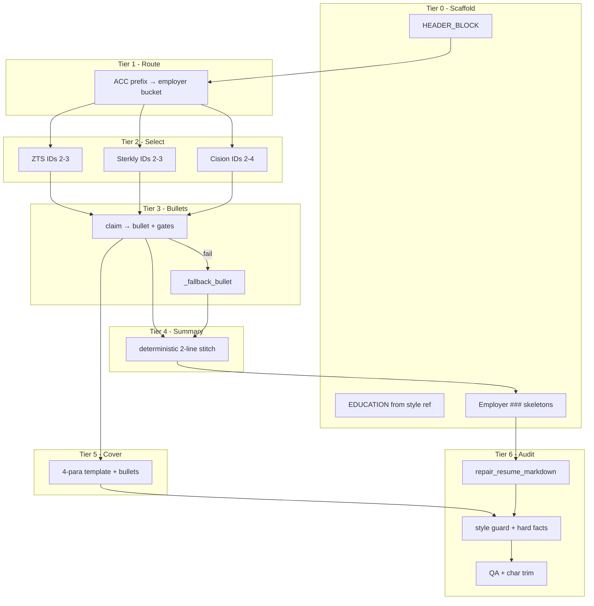

# CR-013: Local Resume & Cover Letter — Bite-Sized Hardening

## Metadata

| Field | Value |
|---|---|
| **CR ID** | `CR-013` |
| **Status** | Approved |
| **Priority** | P0 |
| **Date** | 2026-05-20 |
| **Builds on** | `CR-007`, `CR-012` |
| **Implements** | `FR-085`, `FR-086`, `FR-087`, `FR-088` |

## Design principle: compiler, not author

Local LLMs should **never** own document structure. They only transform **one claim → one bullet**. Assembly, headers, education, employer blocks, summary stitching, and cover-letter paragraphs are **deterministic code**.

Confidence comes from:

1. **Small surface area per call** (≤25 words out, one JSON array out)
2. **Fail-closed gates** after every generative step
3. **Deterministic fallback** that cannot invent (reformat source line)
4. **Manifest** of claim IDs used + fallback count for audit

## Tier model (0–6)

| Tier | Name | LLM? | Responsibility |
|------|------|------|----------------|
| **0** | Scaffold | No | Header, contact, `##` sections, employer `###` lines, EDUCATION |
| **1** | Routing | No | Map `ACC-1xx`→Cision, `ACC-2xx`→Sterkly, `ACC-3xx`→ZTS via ID prefix |
| **2** | Selection | Optional tiny JSON | Pick 2–4 IDs **per employer** (3 calls max), or keyword score fallback |
| **3** | Bullets | Yes, 1 claim/call | Rewrite one bullet; gates: numeric, blocked tools, seniority, word count |
| **4** | Summary | No (default) | Stitch top bullets into 2 lines; optional polish only if gates pass |
| **5** | Cover letter | No (default) | 4-paragraph template filled with **verbatim** approved bullets |
| **6** | Audit | No | `validate_hard_facts`, style guard, `check_resume`, char budget ≤3200 |

## Stage diagram

## Why each risky step was split

| Current weakness | Hardened approach |
|------------------|-------------------|
| Summary LLM can invent metrics | Summary built from bullet text union; no new numbers allowed |
| Cover letter is one big prompt | 4 paragraphs: hook (JD keywords only), 2× proof (bullets), close (template) |
| `_company_for_claim` keyword guess | `ACC-1xx/2xx/3xx` prefix from `workExperience.md` |
| Selection uses first 40 IDs only | Per-employer menus (≤15 IDs each) |
| Empty Sterkly/ZTS sections | `ensure_minimum_bullets_per_employer` pulls deterministic fallbacks |
| Bullet gate = numeric only | + blocked tools, seniority phrases, max 25 words |
| No end-to-end numeric audit | `audit_text_against_bullet_corpus` on full doc |

## Acceptance criteria

- `AC-087`: Every resume bullet traces to a selected claim ID or explicit fallback log line
- `AC-088`: Summary and cover letter contain **no numeric token** absent from bullet corpus
- `AC-089`: Each employer section has ≥2 bullets before assembly
- `AC-090`: Blocked tool or seniority phrase in bullet → automatic `_fallback_bullet` without failing batch
