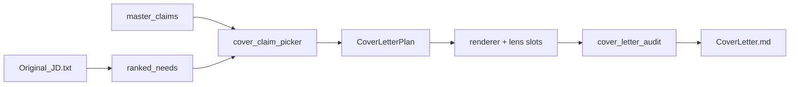

# CR-024 — Cover Letter Conversion Engine

| Field | Value |
|-------|-------|
| **Status** | implemented |
| **Implements** | `FR-157`, `FR-158`, `FR-159`, `FR-160`, `FR-161`, `FR-162`, `FR-163` |
| **Supersedes (cover path)** | `FR-088` bullet-paste cover assembly when `COVER_ENGINE=v1` |
| **Related** | `FR-096` (tone), `data/cover-letter-conversion-best-practices.md` |
| **Layer** | Specs + `scripts/cover_*` + `scripts/draft_compiler.py` |

## Problem

Cover letters were generated as a **resume tail**: same composed bullets, `pick_cover_bullets`, and `assemble_cover_letter_deterministic` produced pasted resume lines with a generic hook. They failed conversion criteria (CL-002 complement, employer-value narrative, JD-specific match).

Resume summaries also chained internal **and** from compound JD theme strings (e.g. “platform reliability and scale and data integrity and ingestion”).

## Solution

**Parallel pipelines** in one `draft_compiler.run()`:

| Pipeline | Inputs | Output |
|----------|--------|--------|
| Resume | JD + catalog → 11 claims → compose bullets → summary | `Resume.md` |
| Cover (`COVER_ENGINE=v1`) | JD + catalog only | `CoverLetter.md`, `cover_letter_plan.json` |

Cover path never reads `Resume.md` for claim selection (`FR-158`).

## Architecture



## Modules

| Module | Role |
|--------|------|
| `scripts/cover_jd_needs.py` | `ranked_needs`, role title, goal phrases; filters salary lines |
| `scripts/cover_claim_picker.py` | JD × catalog proof selection (2 claims, metrics required) |
| `scripts/cover_plan_builder.py` | Rules-only `CoverLetterPlan` |
| `scripts/cover_narrative_templates.py` | Micro-narrative slots + application-first opener |
| `scripts/cover_letter_renderer.py` | Markdown assembly (~300–350 words) |
| `scripts/cover_letter_audit.py` | Conversion rubric; bans “{Co} is hiring” |
| `scripts/cover_letter_compiler.py` | Orchestrator + retry |
| `scripts/cover_prose.py` | `format_themes_for_prose` (resume summary + cover) |
| `scripts/match_thesis_builder.py` | Match thesis lines on plan |
| `scripts/draft_compiler.py` | Wires `COVER_ENGINE=v1`; manifest `cover_letter_plan` |

## Environment

| Variable | Default | Purpose |
|----------|---------|---------|
| `COVER_ENGINE` | `v1` | Use conversion engine (vs legacy `assemble_cover_letter_deterministic`) |
| `COVER_ONLY` | `0` | `1` = regenerate cover + PDF only |
| `LOCAL_ONLY_MODE` | `1` | No cloud LLM for cover prose |

## Acceptance criteria

| ID | Given | When | Then |
|----|-------|------|------|
| `AC-164` | `COVER_ENGINE=v1`, valid JD + catalog | `compile_cover_letter` runs | `CoverLetter.md` has application-first opener, 2 proof bodies, no “is hiring”; audit Pass |
| `AC-165` | Cover plan built | Inspect `cover_letter_plan.json` | Lists `claim_id`, `ranked_needs`, themes; no `Resume.md` input |
| `AC-166` | Batch regen 11 folders | `regenerate_all_cover_letters.py` | All Pass QA; PDFs updated |
| `AC-167` | Resume with compound themes | `build_summary_deterministic` | No “theme and theme and theme” chaining |
| `AC-168` | Cover with metrics from claims | `verify_cover_only_bundle` | Numeric audit uses **claim catalog** corpus |
| `AC-169` | Forbes JD | Pilot letter | Intelligence/rankings theme; not two raw resume bullets |

## Verification

```bash
python scripts/smoke_draft_compiler.py
python scripts/pilot_cover_forbes.py
python scripts/regenerate_all_resumes.py
python scripts/regenerate_all_cover_letters.py
```

## Traceability updates

- `docs/spec/02-requirements-registry.md` — `FR-157`–`FR-163`
- `docs/spec/03-feature-specs/FEAT-013-cover-letter-engine.md`
- `docs/spec/06-traceability/traceability-matrix.md`
- `docs/spec/08-implementation/IMP-CR-024-cover-letter-engine.md`
- `.agent/rules/pipeline_env.md`
- `PRODUCT_CAPABILITIES_AND_RELEASE_NOTES.md` — 6.2.14
